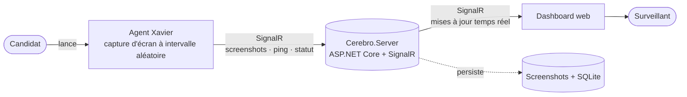

# Cerebro

[](https://github.com/CODA-SCHOOL-FRANCE/cerebro/releases)
[](https://www.npmjs.com/package/xavier-agent)
[](https://github.com/CODA-SCHOOL-FRANCE/homebrew-cerebro)
[](https://github.com/CODA-SCHOOL-FRANCE/cerebro/tree/main/bucket)

Outil anti-fraude pour la surveillance d'épreuves à distance (BYOD, multi-OS).
Chaque candidat lance un agent léger (nommé **Xavier** une fois publié) sur sa propre machine ; l'agent capture des screenshots à intervalles aléatoires et les transmet en temps réel à un serveur central, consulté par le surveillant via un dashboard web.


## Architecture

Deux composants : l'**agent** (installé sur la machine de chaque candidat) capture l'écran et le
transmet en temps réel au **serveur**, qui maintient l'état des sessions et alimente le dashboard
du surveillant.



Détail complet (composants internes, flux de données) : [Architecture](docs/ARCHITECTURE.md).

## Installation

Deux installations séparées : le **serveur** (une fois, côté établissement) et l'**agent** (sur la
machine de chaque candidat).

**Serveur** — un seul conteneur Docker (TLS auto-signé généré automatiquement), image publiée sur GHCR :

```bash
docker pull ghcr.io/coda-school-france/cerebro-server:<version>
CEREBRO_SERVER_VERSION=<version> \
  docker compose -f deploy/docker-compose.yml -f deploy/docker-compose.prod.yml up -d
```

`<version>` = tag Git **sans le préfixe `v`** (ex. `0.1.2`, pas `v0.1.2`) — détail complet
(provisioning, mot de passe dashboard, TLS, visibilité du package GHCR) :
[Déployer le serveur](docs/DEPLOYMENT-SERVER.md).

**Agent** — un seul exécutable, pas de runtime à installer, disponible sur plusieurs canaux :

| Canal | Commande |
|---|---|
| Script (macOS/Linux) | `curl -fsSL https://raw.githubusercontent.com/CODA-SCHOOL-FRANCE/cerebro/main/packaging/install.sh \| sh` |
| Script (Windows) | `irm https://raw.githubusercontent.com/CODA-SCHOOL-FRANCE/cerebro/main/packaging/install.ps1 \| iex` |
| Homebrew (macOS/Linux) | `brew install coda-school-france/cerebro/xavier` |
| Scoop (Windows) | `scoop bucket add xavier https://github.com/CODA-SCHOOL-FRANCE/cerebro && scoop install xavier/xavier` |
| npm (tous OS) | `npx xavier-agent <serverUrl> <sessionCode> <candidateId>` |
| Manuel | archive `Xavier-<version>-<rid>.zip` depuis la [Release GitHub](https://github.com/CODA-SCHOOL-FRANCE/cerebro/releases) |

Détail complet (mise en place initiale, mise à jour automatique des canaux) :
[Déployer l'agent](docs/DEPLOYMENT-AGENT.md#canaux-dinstallation-pour-les-étudiants).

## Prérequis (développement local)

- [.NET SDK 10.0+](https://dotnet.microsoft.com/download)
- `Node.js` / `npm`

## Structure du dépôt

```
Cerebro.sln
src/
  Cerebro.Agent/       # agent candidat (console app), publié sous le nom "xavier"
    Capture/           # IScreenCapturer + implémentations Windows/macOS/Linux
    Realtime/          # client SignalR (ICerebroConnection)
    AgentRunner.cs     # boucle métier (self-test, intervalle aléatoire, reporting)
  Cerebro.Server/      # serveur (ASP.NET Core + SignalR)
    Hubs/CerebroHub.cs
    Services/          # SessionRegistry (état en mémoire), ScreenshotStore (disque)
    Data/              # IExamRepository/SqliteExamRepository (Dapper) : sessions + candidats enregistrés
                       # ISessionActivityStore/FileSessionActivityStore : journal d'activité (texte, screenshots/{session}/activity.log)
    Admin/             # AdminCli (`provision`/`start`, ConsoleAppFramework) + ExamRoster (format du roster de l'école)
    Telemetry/         # CerebroTelemetry (ActivitySource + Meter OpenTelemetry), SessionActivityEventType
    wwwroot/           # dashboard (index.html + app.js + client SignalR vendoré)
  Cerebro.Shared/      # contrats communs (DTOs, Result<byte[], CaptureError> pour la capture) partagés agent/serveur
tests/
  Cerebro.Tests/
    Unit/              # logique pure, sans dépendance OS
    Integration/        # capture réelle, disque réel, SignalR réel de bout en bout
tools/
  Cerebro.LoadSim/     # simule une session avec N candidats depuis une seule machine (voir son README)
packaging/
  npm/                 # wrapper npm "xavier-agent" (télécharge le binaire natif au postinstall, voir son README)
```

## Développement local

```bash
# Compiler toute la solution
dotnet build

# Créer un roster de test minimal
cat > roster-test.json << 'EOF'
{
  "etudiants": [
    { "nom": "Test Candidat", "id": "CAND0001" }
  ]
}
EOF

# Provisionner une session à partir de ce fichier (enregistre chaque candidat du roster en base)
dotnet run --project src/Cerebro.Server -- provision --session SESSION-TEST --input roster-test.json

# Lancer le serveur (dashboard sur l'URL affichée, ex: http://localhost:5204)
dotnet run --project src/Cerebro.Server

# Dans un autre terminal, lancer l'agent (identifiant candidat = CAND0001, le sien, déjà connu de lui)
dotnet run --project src/Cerebro.Agent -- http://localhost:5204 SESSION-TEST CAND0001
```

Ouvrir le dashboard dans un navigateur, entrer le code de session (`SESSION-TEST` dans l'exemple),
cliquer sur "Rejoindre la session".

## Tests

```bash
dotnet test                              # tout
dotnet test --filter "Category=Unit"        # logique pure, rapide
dotnet test --filter "Category=Integration"  # capture réelle, disque réel, SignalR réel
```

Pour un test manuel de bout en bout (serveur + plusieurs agents, dashboard, scénarios d'erreur), voir [TESTING.md](TESTING.md).

## Autres documentations
- [Architecture](docs/ARCHITECTURE.md)
- [Fonctionnalités supportées](docs/FEATURES.md)
- [Déployer le serveur](docs/DEPLOYMENT-SERVER.md)
- [Déployer l'agent](docs/DEPLOYMENT-AGENT.md)
- [Documentation candidat](docs/USER-DOC.txt)
- [Protocole de test manuel de bout en bout](TESTING.md) 