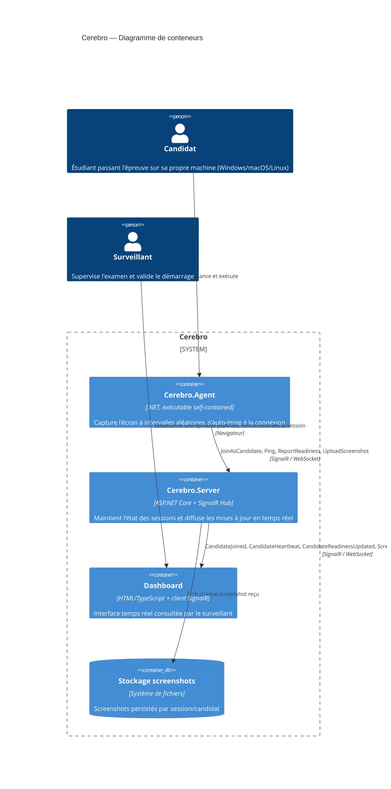
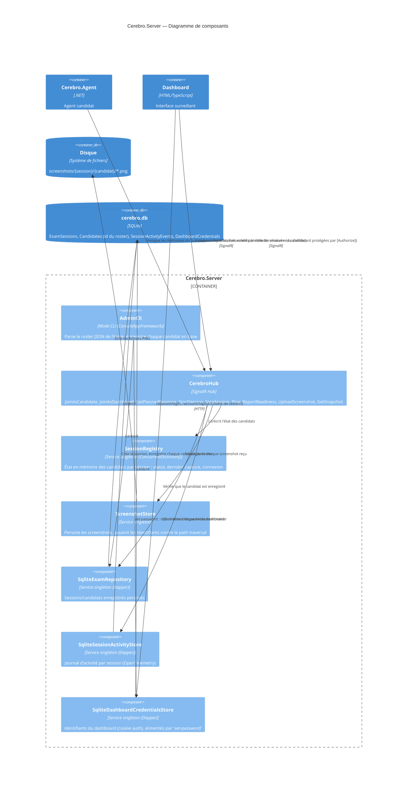

# Cerebro

Outil anti-fraude pour la surveillance d'épreuves certifiantes à distance (BYOD, multi-OS).
Chaque candidat lance un agent léger sur sa propre machine ; l'agent capture des screenshots à
intervalles aléatoires et les transmet en temps réel à un serveur central, consulté par le
surveillant via un dashboard web.


## Sommaire

- [Architecture](#architecture)
- [Fonctionnalités](#fonctionnalités-supportées)
- [Télémétrie](#télémétrie)
- [Limites connues / à faire avant un examen réel](#limites-connues--à-faire-avant-un-examen-réel)
- [Prérequis](#prérequis)
- [Structure du dépôt](#structure-du-dépôt)
- [Développement local](#développement-local)
- [Tests](#tests)
- [Déploiement pour un examen](#déploiement-pour-un-examen)
  - [Docker](#docker)
  - [Sécurisation du transport (TLS)](#3-sécurisation-du-transport-tls)
- [Utilisation le jour J](#utilisation-le-jour-j)

## Architecture

### Conteneurs (C4 — niveau 2)



### Composants de `Cerebro.Server` (C4 — niveau 3)



- **`Cerebro.Agent`** — console app .NET, un binaire par OS. Capture l'écran, s'auto-teste à la
  connexion, puis boucle à intervalle aléatoire.
- **`Cerebro.Server`** — ASP.NET Core + SignalR Hub. Reçoit les screenshots, maintient l'état des
  candidats par session, sert le dashboard temps réel. Inclut aussi un mode admin en CLI
  (`provision`/`start`, via [ConsoleAppFramework](https://github.com/Cysharp/ConsoleAppFramework))
  et la persistance des sessions/candidats en SQLite. Le dashboard (`wwwroot/ts/*.ts`) est écrit en
  TypeScript et compilé en JavaScript brut (`wwwroot/js/`, non committé, servi tel quel sans
  bundler). La compilation est automatique : `dotnet build`/`dotnet run` recompile les `.ts`
  modifiés avant chaque build (cible MSBuild `BuildDashboardTypeScript`). **Prérequis unique** :
  lancer `npm install` une fois depuis `src/Cerebro.Server/` (nécessite Node.js) — sans ça,
  `wwwroot/js/` n'existe pas et le dashboard ne se charge pas dans le navigateur.
- **`Cerebro.Shared`** — contrats communs (DTOs, résultats de capture) partagés entre agent et
  serveur.
- **`Cerebro.Tests`** — xUnit + NFluent, tests Unit (logique pure) et Integration (capture d'écran
  réelle, écriture disque réelle, aller-retour SignalR réel via `WebApplicationFactory`).

## Fonctionnalités supportées

- **Capture d'écran multi-OS** : Windows (GDI via P/Invoke), macOS (`screencapture` système),
  Linux (cascade `grim` → `scrot` → `import` → `gnome-screenshot`, premier outil disponible).
- **Auto-test de préparation** : à la connexion, l'agent capture un screenshot de test et remonte
  le résultat (prêt / échec + raison : permission refusée, outil manquant, etc.) — le surveillant
  voit un vrai statut de préparation, pas juste "connecté".
- **Dashboard temps réel** : liste des épreuves planifiées (provisionnées) à sélectionner — plus
  besoin de connaître/taper un code de session — puis, une fois une épreuve choisie, liste des
  candidats avec statut, horodatage du dernier screenshot reçu, mise à jour instantanée (SignalR),
  sans dépendance à un CDN externe (client JS vendoré localement — fonctionne sans accès internet
  le jour J).
- **Suivi de connexion en direct** : chaque agent envoie un battement (`Ping`) toutes les 60
  secondes par défaut, indépendamment des screenshots. Le dashboard affiche le statut de connexion
  et l'horodatage du dernier signal reçu par candidat ; si un agent se déconnecte (perte réseau,
  fermeture de l'application, machine éteinte...), sa ligne reste visible mais passe **en rouge**
  au lieu de disparaître — le surveillant voit immédiatement qui a décroché, plutôt que de perdre
  la trace du candidat.
- **Démarrage/arrêt de session depuis le dashboard** : le surveillant démarre l'épreuve
  (`StartSession`) une fois tous les candidats connectés et prêts, puis l'arrête en fin d'épreuve
  (`StopSession`) — après quoi le hub refuse toute nouvelle connexion d'agent pour cette session
  (`Cette session est terminée, les connexions ne sont plus acceptées.`). Les candidats déjà
  connectés au moment de l'arrêt ne sont pas déconnectés de force (voir limites connues).
- **Reconnexion automatique** : coupure réseau ponctuelle gérée par l'agent, qui rejoint
  automatiquement la session et renvoie son dernier statut connu.
- **Capture à intervalle aléatoire**, configurable (8–12 minutes par défaut, soit ~10 minutes en
  moyenne) — volontairement aléatoire pour ne pas être prévisible.
- **Stockage des screenshots côté serveur**, organisé par session/candidat, avec assainissement
  strict des identifiants pour empêcher toute traversée de répertoire.
- **Limite de message SignalR relevée à 50 Mo** pour supporter des screenshots plein écran /
  multi-moniteur / retina.
- **Chiffrement en transit par épinglage de certificat** : l'agent peut valider le certificat du
  serveur par empreinte SHA-256 plutôt que par la chaîne de confiance du système — utile derrière
  un reverse proxy TLS auto-signé sans avoir à installer une CA sur chaque machine étudiante (voir
  [Sécurisation du transport](#3-sécurisation-du-transport-tls)).
- **Authentification par identifiant candidat enregistré** : le provisioning charge le roster
  officiel de l'épreuve (export existant de l'école) en base SQLite, et le hub vérifie que
  l'identifiant fourni par l'agent y est bien enregistré pour cette session avant d'accepter la
  connexion. Connaître seulement le code de session ne suffit plus à rejoindre une session ou à
  usurper un candidat (voir [Provisionner une épreuve](#4-provisionner-une-épreuve)).
- **Dashboard protégé par identifiant/mot de passe** : accéder à `/index.html` (ou `/`) redirige
  vers un écran de connexion tant que la session n'est pas ouverte (cookie HttpOnly, 12h,
  `SameSite=Strict`). Les identifiants sont définis via `set-password` (mot de passe hashé en
  PBKDF2-SHA256, jamais stocké en clair) et n'affectent en rien les agents candidats, qui restent
  authentifiés uniquement par code de session + id candidat — seules les méthodes du hub réservées
  au dashboard (`GetPlannedSessions`, `StartSession`, etc.) exigent la session ouverte.
- **Télémétrie OpenTelemetry** : chaque connexion, déconnexion, screenshot reçu et changement de
  statut de préparation est tracé (`ActivitySource`) et compté (métriques), et persisté dans un
  journal d'activité par session en base SQLite — consultable directement depuis le dashboard
  (bouton "Journal d'activité"), sans outil externe. Voir [Télémétrie](#télémétrie).

## Télémétrie

Cerebro instrumente `Cerebro.Server` avec le SDK OpenTelemetry (`Telemetry/CerebroTelemetry.cs`) :

- **Traces** : un span par évènement métier clé (`Candidate.Join`, `Candidate.Disconnect`,
  `Candidate.ReportReadiness`, `Candidate.UploadScreenshot`, `Session.Start`, `Session.Stop`), tagué
  `cerebro.session_code` / `cerebro.candidate_id`. Exportées en console par défaut (visibles sur le
  terminal du serveur).
- **Métriques** : compteurs `cerebro.candidates.joined`, `cerebro.candidates.disconnected`,
  `cerebro.pings.received`, `cerebro.screenshots.received`, `cerebro.sessions.started`,
  `cerebro.sessions.ended`, plus les métriques HTTP standard d'ASP.NET Core. Exportées en console
  par défaut.
- **Journal d'activité persisté** : au-delà des traces/métriques (utiles pour du debug live sur le
  terminal, mais éphémères), chaque évènement métier est aussi écrit dans une table SQLite
  (`SessionActivityEvents`, même fichier que `cerebro.db`) via `ISessionActivityStore`. C'est la
  source principale pour répondre à "qui s'est connecté, qui a envoyé quoi, quelles sessions ont
  été réalisées" — consultable directement dans le dashboard (bouton "Journal d'activité" une fois
  une session sélectionnée), sans avoir besoin d'un outil d'observabilité externe. Le `Ping` (toutes
  les 60s/candidat) n'est **pas** journalisé individuellement — seulement compté en métrique — pour
  éviter de noyer le journal d'une session de plusieurs heures sous des milliers de lignes.

Le réseau d'examen étant volontairement isolé (pas d'accès internet le jour J, voir
[Sécurisation du transport](#3-sécurisation-du-transport-tls)), aucun backend cloud (Application
Insights, Datadog...) n'est utilisé. Si un jour tu veux un vrai backend d'observabilité auto-hébergé
(Seq, Grafana + Tempo/Loki/Prometheus...), il suffit de remplacer `AddConsoleExporter()` par
`AddOtlpExporter()` dans `Program.cs` — le code d'instrumentation (spans, compteurs, hub) n'a pas à
changer.

## Limites connues / à faire avant un examen réel

Ce projet est fonctionnel mais **pas encore prêt pour un examen certificatif réel**. À traiter avant :

- ✅ ~~Pas de TLS/HTTPS configuré~~ — traité : voir
  [Sécurisation du transport](#3-sécurisation-du-transport-tls) (reverse proxy Caddy + épinglage de
  certificat côté agent). Reste un point d'attention : le navigateur du surveillant affichera un
  avertissement "connexion non sécurisée" pour le certificat auto-signé (à accepter une fois,
  humainement, sur ce seul poste — ce n'est pas automatisable sans CA publique).
- ✅ ~~Aucune authentification sur le hub~~ — traité côté candidat : voir
  [Provisionner une épreuve](#4-provisionner-une-épreuve) (l'agent doit fournir un identifiant
  candidat réellement enregistré en base pour cette session, via le roster officiel de l'épreuve).
  Limites résiduelles : le **dashboard n'a toujours aucune authentification** — quiconque atteint
  l'URL du serveur voit la liste de toutes les épreuves planifiées (`GetPlannedSessions`) et peut
  démarrer/arrêter n'importe laquelle (`StartSession`/`StopSession`), sans distinction de rôle ; il
  n'y a pas de limitation de débit sur les tentatives de connexion candidat (un identifiant inconnu
  peut être retenté indéfiniment, sans blocage après N échecs) ; et l'identifiant candidat n'est pas
  un secret cryptographique généré pour l'occasion — sa robustesse dépend entièrement de la façon
  dont l'école génère et distribue ces id dans son propre outillage. **À sécuriser avant tout accès
  réseau non maîtrisé au dashboard** (typiquement : réseau d'examen isolé + accès physique
  restreint au poste surveillant, en attendant une authentification dédiée).
- ⚠️ **Pas de signature de code.** macOS bloquera l'agent via Gatekeeper (pas de compte Apple
  Developer) ; Windows affichera un avertissement SmartScreen. Voir les instructions étudiants
  plus bas.
- ⚠️ **Linux dépend d'outils externes non embarqués** (`grim`/`scrot`/`import`/`gnome-screenshot`) :
  à vérifier/installer sur les machines Linux avant l'examen.
- ⚠️ **Pas de politique de rétention/suppression automatique** des screenshots après correction
  (recommandé pour la conformité RGPD).
- ✅ ~~Pas de "top départ"~~ — partiellement traité : le surveillant démarre/arrête désormais
  l'épreuve depuis le dashboard (`StartSession`/`StopSession`), ce qui bloque les nouvelles
  connexions candidat après l'arrêt. Limite résiduelle : arrêter la session ne déconnecte pas de
  force les candidats déjà connectés (ils peuvent continuer à envoyer des screenshots jusqu'à ce
  qu'ils ferment l'agent eux-mêmes) ; et Cerebro ne débloque aucun contenu d'épreuve externe (LMS,
  sujet PDF...) — hors de son périmètre, qui reste la seule surveillance par capture d'écran.
- ⚠️ **Capture testée uniquement sur macOS** (machine de développement). Les implémentations
  Windows et Linux compilent et passent les tests d'intégration *sur l'OS où ils tournent*, mais
  n'ont pas encore été validées sur du matériel réel.

## Prérequis

- [.NET SDK 10.0+](https://dotnet.microsoft.com/download)
- Pour le déploiement multi-OS de l'agent : aucune dépendance supplémentaire (publication
  self-contained, voir plus bas)

## Structure du dépôt

```
Cerebro.sln
src/
  Cerebro.Agent/       # agent candidat (console app)
    Capture/           # IScreenCapturer + implémentations Windows/macOS/Linux
    Realtime/          # client SignalR (ICerebroConnection)
    AgentRunner.cs     # boucle métier (self-test, intervalle aléatoire, reporting)
  Cerebro.Server/      # serveur (ASP.NET Core + SignalR)
    Hubs/CerebroHub.cs
    Services/          # SessionRegistry (état en mémoire), ScreenshotStore (disque)
    Data/              # IExamRepository/SqliteExamRepository (Dapper) : sessions + candidats enregistrés
                       # ISessionActivityStore/SqliteSessionActivityStore (Dapper) : journal d'activité
    Admin/             # AdminCli (`provision`/`start`, ConsoleAppFramework) + ExamRoster (format du roster de l'école)
    Telemetry/         # CerebroTelemetry (ActivitySource + Meter OpenTelemetry), SessionActivityEventType
    wwwroot/           # dashboard (index.html + app.js + client SignalR vendoré)
  Cerebro.Shared/      # contrats communs (DTOs, Result<byte[], CaptureError> pour la capture) partagés agent/serveur
tests/
  Cerebro.Tests/
    Unit/              # logique pure, sans dépendance OS
    Integration/        # capture réelle, disque réel, SignalR réel de bout en bout
```

## Développement local

```bash
# Compiler toute la solution
dotnet build

# Créer un roster de test minimal (même format que l'export officiel de l'école)
cat > roster-test.json << 'EOF'
{
  "ec": "TEST",
  "date": "2026-01-01",
  "rattrapage": false,
  "etudiants": {
    "test@example.com": { "nom": "Test Candidat", "id": "CAND0001", "promo": "B1" }
  },
  "diplome": "TEST"
}
EOF

# Provisionner une session à partir de ce fichier (enregistre chaque candidat du roster en base)
dotnet run --project src/Cerebro.Server -- provision --session SESSION-TEST --input roster-test.json

# Lancer le serveur (dashboard sur l'URL affichée, ex: http://localhost:5204)
dotnet run --project src/Cerebro.Server

# Dans un autre terminal, lancer l'agent (identifiant candidat = CAND0001, le sien, déjà connu de lui)
dotnet run --project src/Cerebro.Agent -- http://localhost:5204 SESSION-TEST CAND0001
```

Ouvrir le dashboard dans un navigateur, entrer le code de session (`SESSION-TEST` dans l'exemple),
cliquer sur "Rejoindre la session".

## Tests

```bash
dotnet test                              # tout
dotnet test --filter "Category=Unit"        # logique pure, rapide
dotnet test --filter "Category=Integration"  # capture réelle, disque réel, SignalR réel
```

Les tests d'intégration de capture d'écran ne valident que l'OS sur lequel ils s'exécutent — à
rejouer sur une vraie machine Windows et Linux avant d'y faire confiance. En environnement CI
headless (sans session d'affichage), ils échoueront probablement et devront être exclus du
pipeline.

Pour un test manuel de bout en bout (serveur + plusieurs agents, dashboard, scénarios d'erreur),
voir [TESTING.md](TESTING.md).

## Déploiement pour un examen

### 1. Serveur

```bash
dotnet publish src/Cerebro.Server -c Release -o ./publish/server
```

Exécuter le résultat (`dotnet Cerebro.Server.dll` ou l'exécutable natif) sur une machine
accessible par tous les postes candidats sur le réseau de l'examen (même réseau local suffit,
pas besoin d'accès internet — le client SignalR est vendoré). Ouvrir le port correspondant dans
le pare-feu. **Mettre un reverse proxy TLS devant en production** (voir section suivante).

### Docker

Alternative à la publication en binaire : `src/Cerebro.Server/Dockerfile` construit une image
autonome (dashboard TypeScript compilé + serveur .NET publié, sans dépendance à Node ni au SDK
.NET à l'exécution). Build à lancer depuis la racine du dépôt (le serveur référence
`Cerebro.Shared` par chemin relatif) :

```bash
docker build -f src/Cerebro.Server/Dockerfile -t cerebro-server .

docker run -d \
  -p 127.0.0.1:8080:8080 \
  -v cerebro-db:/app/db \
  -v cerebro-screenshots:/app/screenshots \
  --name cerebro-server cerebro-server
```

- Le conteneur tourne en non-root (utilisateur `app` fourni par l'image `dotnet/aspnet` de base).
- `db/` (SQLite) et `screenshots/` sont déclarés en `VOLUME` : à monter (volume nommé ou bind
  mount) pour survivre à un redéploiement — sans ça, tout est perdu au `docker rm`.
- Le port publié doit rester lié à `127.0.0.1` (jamais `0.0.0.0`) : le conteneur, comme le binaire,
  ne doit pas être exposé directement sur le réseau — voir [Sécurisation du transport](#3-sécurisation-du-transport-tls)
  pour le reverse proxy TLS à mettre devant.
- Un tag `vX.Y.Z` poussé sur un commit de `main` déclenche `.github/workflows/server-release.yml` :
  tests, build de l'image, publication sur GHCR (`ghcr.io/<owner>/cerebro-server`) et création de
  la Release GitHub correspondante.

**Recommandé : tout conteneuriser**, plutôt que ce mode hybride (conteneur + Caddy installé à la
main sur l'hôte). `deploy/docker-compose.yml` fait tourner `cerebro-server` et Caddy dans deux
conteneurs séparés sur un réseau Docker interne : `cerebro-server` ne publie aucun port (joignable
uniquement par Caddy, via le nom de service `cerebro-server:8080` résolu par le DNS interne de
Docker), seul Caddy expose `8443` vers l'extérieur.

```bash
CEREBRO_SERVER_ADDRESS=192.168.1.10 docker compose -f deploy/docker-compose.yml up -d --build
```

Le `Caddyfile` est partagé entre les trois modes de déploiement (binaire, conteneur seul,
docker-compose) via la variable `CEREBRO_UPSTREAM` — voir les commentaires en tête de
`deploy/Caddyfile` pour le détail de chaque cas. Un seul point d'attention propre à ce mode : le
volume `caddy_data` contient la CA locale et le certificat générés par `tls internal` — sans lui,
ils sont régénérés à chaque recréation du conteneur Caddy, ce qui change l'empreinte SHA-256 à
recommuniquer aux agents (`docker compose down -v` détruit ce volume, à éviter en cours de
session).

### 2. Agent, un exécutable autonome par OS

`dotnet publish` en mode self-contained + fichier unique : l'étudiant n'a besoin ni de Python ni
du runtime .NET installé.

```bash
dotnet publish src/Cerebro.Agent -c Release -r win-x64   --self-contained -p:PublishSingleFile=true -o ./publish/agent-win-x64
dotnet publish src/Cerebro.Agent -c Release -r osx-x64   --self-contained -p:PublishSingleFile=true -o ./publish/agent-osx-x64
dotnet publish src/Cerebro.Agent -c Release -r osx-arm64 --self-contained -p:PublishSingleFile=true -o ./publish/agent-osx-arm64
dotnet publish src/Cerebro.Agent -c Release -r linux-x64 --self-contained -p:PublishSingleFile=true -o ./publish/agent-linux-x64
```

Ajouter `-p:ObfuscateAgent=true` pour obfusquer le binaire (renommage des types/méthodes, chaînes
masquées — voir `src/Cerebro.Agent/obfuscar.xml`) : un candidat qui ouvre l'exécutable dans un
décompilateur (dnSpy/ILSpy) ne doit pas retrouver directement la structure du code. Nécessite
[Obfuscar](https://github.com/obfuscar/obfuscar) (`dotnet tool install --global Obfuscar.GlobalTool`) ;
désactivé par défaut (bruit inutile en développement local).

**Ou via GitHub Actions** : un tag `agent-vX.Y.Z` poussé sur un commit de `main` déclenche
`.github/workflows/agent-release.yml` — build obfusqué pour les 4 OS ci-dessus, empaqueté avec les
instructions d'installation (`deploy/agent-install/INSTALLATION.txt`, contournement SmartScreen/
Gatekeeper inclus), et création d'une **Release GitHub en brouillon** (à relire et publier
manuellement, ce sont des binaires exécutés directement par les candidats).

### 3. Sécurisation du transport (TLS)

Sur un réseau d'examen isolé, il n'y a pas de CA publique disponible pour obtenir un certificat
classique (type Let's Encrypt) : la solution est un **reverse proxy TLS avec certificat
auto-signé**, devant le serveur qui reste en HTTP local.

**1. Lier `Cerebro.Server` uniquement à la boucle locale** (pas exposé directement sur le réseau) :

```bash
ASPNETCORE_URLS=http://127.0.0.1:5289 dotnet Cerebro.Server.dll
```

Ou, en conteneur (voir [Docker](#docker) ci-dessous) — le port publié doit rester lié à
`127.0.0.1`, jamais à `0.0.0.0`, pour la même raison :

```bash
docker run -d -p 127.0.0.1:8080:8080 \
  -v cerebro-db:/app/db -v cerebro-screenshots:/app/screenshots \
  --name cerebro-server ghcr.io/<owner>/cerebro-server:<version>
```

Dans ce cas, adapter le `reverse_proxy` de `deploy/Caddyfile` sur le port `8080` (au lieu de
`5289`) — un commentaire dans ce fichier rappelle les deux cas.

**2. Démarrer [Caddy](https://caddyserver.com/) devant**, avec le `Caddyfile` fourni dans
`deploy/Caddyfile` — il génère et sert automatiquement un certificat auto-signé via sa CA interne :

```bash
CEREBRO_SERVER_ADDRESS=192.168.1.10 caddy run --config deploy/Caddyfile
```

(remplacer `192.168.1.10` par l'IP ou le nom d'hôte réel du poste serveur sur le réseau
d'examen). Les candidats et le surveillant se connectent alors sur `https://192.168.1.10:8443`.

**3. Récupérer l'empreinte SHA-256 du certificat**, à communiquer aux agents étudiants :

```bash
openssl s_client -connect 192.168.1.10:8443 </dev/null 2>/dev/null \
  | openssl x509 -noout -fingerprint -sha256
```

**4. Communiquer cette empreinte** aux candidats en même temps que l'URL du serveur et le code de
session (annonce orale/écran en début de session, voir
[Provisionner une épreuve](#4-provisionner-une-épreuve)). Elle se passe en 4ᵉ argument positionnel
de l'agent (après l'identifiant candidat) ou via la variable d'environnement
`CEREBRO_SERVER_CERT_THUMBPRINT` :

```bash
Cerebro.Agent https://192.168.1.10:8443 F2I-20260801-A FFFB5AB1 "19D497B5...3B5E"
```

L'agent valide alors le certificat du serveur par **épinglage d'empreinte** plutôt que par la
chaîne de confiance du système : un certificat différent (machine usurpée, MITM) est rejeté, sans
qu'il soit nécessaire d'installer une CA sur chaque machine étudiante — une charge de configuration
supplémentaire peu réaliste en BYOD, le jour d'un examen. Si l'empreinte n'est pas fournie, l'agent
retombe sur la validation TLS standard (utile en HTTP simple, ou si le serveur possède un vrai
certificat reconnu).

Le **navigateur du surveillant**, lui, affichera un avertissement pour ce certificat auto-signé :
à accepter une fois manuellement sur ce seul poste (bouton "Continuer quand même" / "Avancé...").

### 4. Provisionner une épreuve

L'admin fournit le code de session et le fichier JSON de l'épreuve (export existant de l'école,
format `ec`/`date`/`rattrapage`/`etudiants`/`correcteurs`/`diplome`) :

```json
{
  "ec": "E01",
  "date": "2026-10-09",
  "rattrapage": false,
  "etudiants": {
    "yoan.thirion@outlook.fr": { "nom": "Jean Luc", "id": "FFFB5AB1", "promo": "B1", "drive_folder_id": "..." },
    "yoan.thirion@gmail.com": { "nom": "Herr Cul", "id": "0770F2DB", "promo": "B1", "drive_folder_id": "..." }
  },
  "correcteurs": [{ "nom": "Yoan Thirion", "email": "yoan.thirion@ik.me" }],
  "diplome": "RNCP39608-CDWFS"
}
```

```bash
dotnet Cerebro.Server.dll provision --session F2I-20260801-A --input epreuve-e01.json --db ./cerebro.db
```

Le champ **`id`** de chaque étudiant (ex: `FFFB5AB1`) sert à la fois d'identifiant candidat et de
secret de connexion — pas de jeton généré séparément : c'est déjà un identifiant propre à l'école,
non devinable.

`provision` n'enregistre chaque candidat qu'en base — aucun fichier n'est généré ni distribué. Le
jour J, l'admin/surveillant communique une seule fois à toute la salle (tableau, écran de
projection...) l'URL du serveur, le code de session et, le cas échéant, l'empreinte du certificat
TLS. Chaque étudiant connaît déjà son propre **id** (c'est le sien, tel qu'il apparaît dans le
roster de l'école) et le saisit lui-même — rien à transmettre individuellement, donc rien à faire
correspondre entre un fichier et un étudiant.

Le même fichier `cerebro.db` doit être utilisé par le serveur au démarrage (variable
`ConnectionStrings__CerebroDb`, ou `appsettings.json` → `ConnectionStrings:CerebroDb`) :

```bash
ConnectionStrings__CerebroDb="Data Source=./cerebro.db" dotnet Cerebro.Server.dll
```

Une fois l'épreuve prête à démarrer (tous les candidats connectés et prêts sur le dashboard) :

```bash
dotnet Cerebro.Server.dll start --session F2I-20260801-A --db ./cerebro.db
```

Pour l'instant, cette commande se contente d'horodater le démarrage en base (utile pour l'audit) —
elle ne bloque pas encore les connexions tardives ni ne débloque automatiquement le sujet d'examen
(voir limites connues, "pas de top départ").

### 5. Instructions à donner aux étudiants (à faire la veille, pas le jour J)

- **Windows** : au premier lancement, SmartScreen affichera "Windows a protégé votre PC" →
  cliquer sur *Informations complémentaires* puis *Exécuter quand même*.
- **macOS** : Gatekeeper bloquera l'app (pas de compte Apple Developer) → **clic droit sur
  l'exécutable → Ouvrir** (une seule fois). Accorder ensuite la permission **Enregistrement de
  l'écran** dans *Réglages Système → Confidentialité et sécurité* quand macOS la demande.
- **Linux** : vérifier qu'un outil de capture est installé (`grim` sous Wayland, ou `scrot` /
  ImageMagick `import` / `gnome-screenshot` sous X11) — sinon `sudo apt install scrot` (ou
  équivalent selon la distribution).

## Utilisation le jour J

1. Annoncer une fois à toute la salle l'URL du serveur, le code de session et, si TLS est activé,
   l'empreinte du certificat (voir [provisioning](#4-provisionner-une-épreuve)).
2. Chaque candidat lance l'agent avec ces valeurs et son propre id (déjà connu de lui), par
   exemple `Cerebro.Agent https://192.168.1.10:8443 F2I-20260801-A FFFB5AB1 "19D497B5...3B5E"` —
   ou répond simplement aux invites interactives s'il lance l'agent sans argument.
3. Le surveillant ouvre le dashboard : il voit la liste des épreuves planifiées et **sélectionne**
   celle du jour (plus besoin de taper un code), puis attend que tous les candidats apparaissent
   avec le statut **Prêt** (pas juste connectés — un statut **Échec** indique un problème de
   permission macOS ou d'outil manquant sous Linux, à résoudre avant de démarrer).
4. Le surveillant clique sur **Démarrer l'épreuve** dans le dashboard une fois tout le monde prêt
   (équivalent CLI : `dotnet Cerebro.Server.dll start --session F2I-20260801-A`).
5. En fin d'épreuve, il clique sur **Arrêter l'épreuve** : le hub refuse alors toute nouvelle
   connexion candidat pour cette session (les candidats déjà connectés ne sont pas coupés de force
   — voir limites connues).
