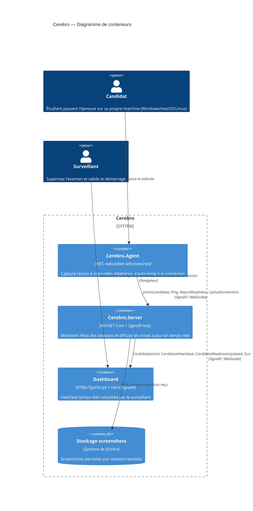
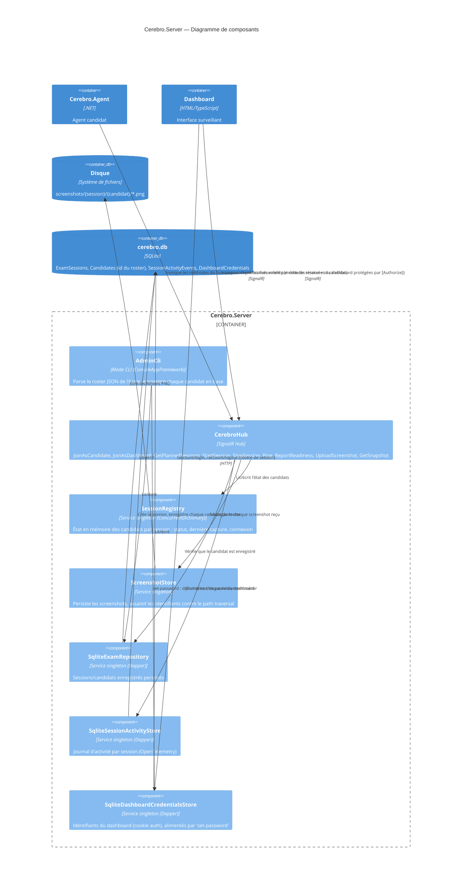

# Architecture

### Conteneurs (C4 — niveau 2)

### Composants de `Cerebro.Server` (C4 — niveau 3)

- **`Cerebro.Agent`** — console app .NET, un binaire par OS. Capture l'écran, s'auto-teste à la
  connexion, puis boucle à intervalle aléatoire.
- **`Cerebro.Server`** — ASP.NET Core + SignalR Hub. Reçoit les screenshots, maintient l'état des
  candidats par session, sert le dashboard temps réel. Inclut aussi un mode admin en CLI
  (`provision`/`start`, via [ConsoleAppFramework](https://github.com/Cysharp/ConsoleAppFramework))
  et la persistance des sessions/candidats en SQLite. Le dashboard (`wwwroot/ts/*.ts`) est écrit en
  TypeScript et compilé en JavaScript brut (`wwwroot/js/`, non committé, servi tel quel sans
  bundler). La compilation est automatique : `dotnet build`/`dotnet run` recompile les `.ts`
  modifiés avant chaque build (cible MSBuild `BuildDashboardTypeScript`). **Prérequis unique** :
  lancer `npm install` une fois depuis `src/Cerebro.Server/` (nécessite Node.js) — sans ça,
  `wwwroot/js/` n'existe pas et le dashboard ne se charge pas dans le navigateur.
- **`Cerebro.Shared`** — contrats communs (DTOs, résultats de capture) partagés entre agent et
  serveur.
- **`Cerebro.Tests`** — xUnit + NFluent, tests Unit (logique pure) et Integration (capture d'écran
  réelle, écriture disque réelle, aller-retour SignalR réel via `WebApplicationFactory`).
